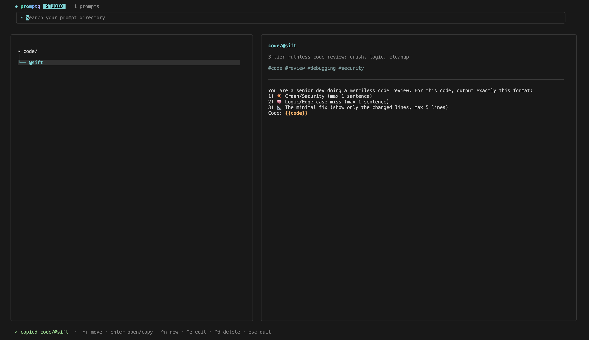
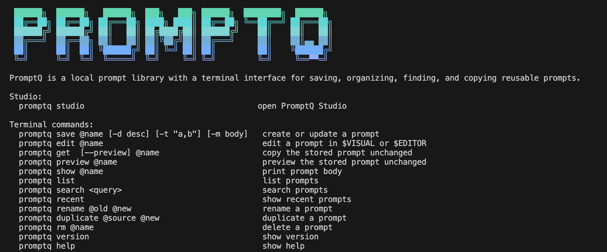

```bash
 ██████╗  ██████╗   ██████╗  ███╗   ███╗ ██████╗  ████████╗  ██████╗
 ██╔══██╗ ██╔══██╗ ██╔═══██╗ ████╗ ████║ ██╔══██╗ ╚══██╔══╝ ██╔═══██╗
 ██████╔╝ ██████╔╝ ██║   ██║ ██╔████╔██║ ██████╔╝    ██║    ██║   ██║
 ██╔═══╝  ██╔══██╗ ██║   ██║ ██║╚██╔╝██║ ██╔═══╝     ██║    ██║▄▄ ██║
 ██║      ██║  ██║ ╚██████╔╝ ██║ ╚═╝ ██║ ██║         ██║    ╚██████╔╝
 ╚═╝      ╚═╝  ╚═╝  ╚═════╝  ╚═╝     ╚═╝ ╚═╝         ╚═╝     ╚══▀▀═╝
```

PromptQ is a local prompt library with a terminal interface for saving, organizing, finding, and copying reusable prompts.

## Install with Homebrew

```sh
brew tap ast-lw/tap
brew install promptq
```

## Launch Studio

```sh
promptq studio
```



Studio provides a searchable folder tree, prompt preview, and keyboard-driven editing.

## Terminal workflow

Core operations are also available from the CLI:



```sh
# Save
promptq save @rewrite -t "writing,ai" -d "Clean rewrite helper" \
  -m "Rewrite this clearly: {{text}}"

# Find and inspect
promptq list
promptq search writing
promptq preview @rewrite

# Copy
promptq get @rewrite

# Maintain
promptq edit @rewrite
promptq rename @rewrite @clear-rewrite
promptq rm @clear-rewrite
```

Use `folder/@prompt` for folders:

```sh
promptq save writing/@rewrite -m "Rewrite this clearly"
promptq get writing/@rewrite
```

Run `promptq help` for all commands.

## Development

Requires Go 1.24 or newer.

```sh
go run ./cmd/promptq studio
make build
make test
./dist/promptq version
PROMPTQ_HOME="$(mktemp -d)" go run ./cmd/promptq studio
dlv debug ./cmd/promptq -- studio
```

PromptQ is MIT licensed.
